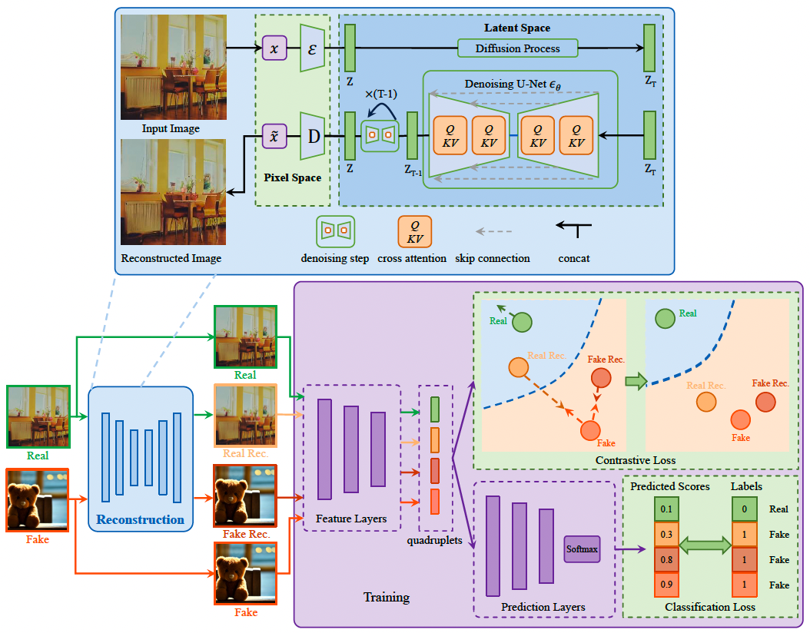
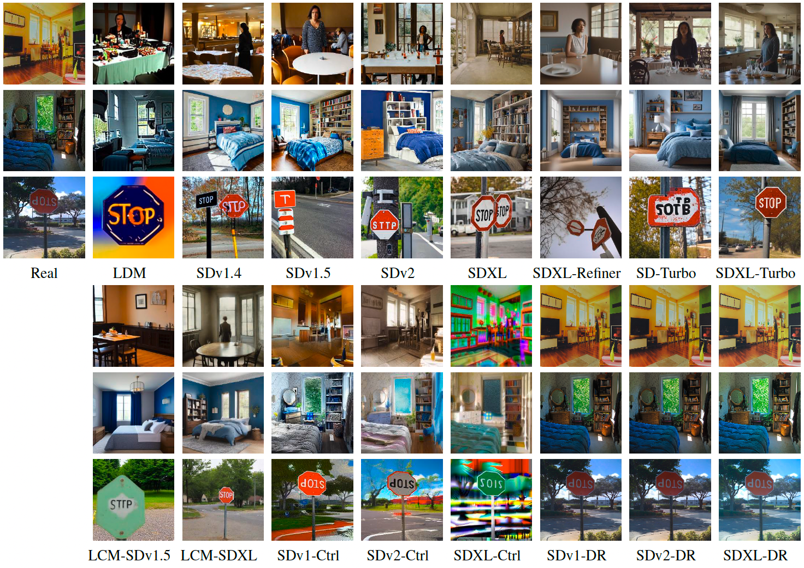
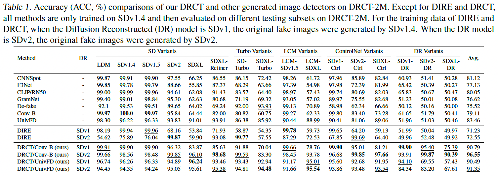
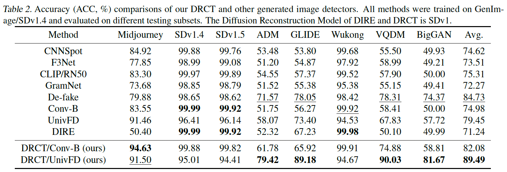
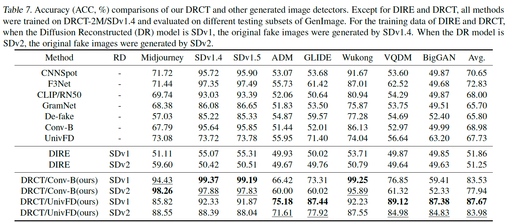

# DRCT: Diffusion Reconstruction Contrastive Training towards Universal Detection of Diffusion Generated Images
The official code of [DRCT: Diffusion Reconstruction Contrastive Training towards Universe Detection of Diffusion Generated Images](https://icml.cc/virtual/2024/poster/33086) ([pdf](https://raw.githubusercontent.com/mlresearch/v235/main/assets/chen24ay/chen24ay.pdf)), 
which was accepted by ICML2024 Spotlight.
## DRCT
The DRCT framework consists of two stages:
- Diffusion Reconstruction. An original image (either real or fake) undergoes a diffusion-then-reconstruction process, resulting in its reconstructed version that retains the original content while containing subtle diffusion artifacts.
- Contrastive Training. The detector is trained under the guidance of margin-based contrastive loss on real images, generated images, and their reconstructed counterparts (real rec. and fake rec.). In contrastive training, real images are labeled as “Real”, while the other three types of images are labeled as “Fake”.

<p align="center">The framework of our proposed DRCT.</p>

## DRCT-2M Dataset
The proposed dataset "DRCT-2M" has been released on [modelscope](https://modelscope.cn/datasets/BokingChen/DRCT-2M/files).

<p align="center">Some examples of generated images in DRCT-2M.</p>

## Diffusion Reconstruction
```
python data/diffusion_rec.py
```

## Training and Validation
### Training On ConvB
```convnext_base_in22k
# real_path: /disk1/chenby/dataset/AIGC_data/DRCT_data/MSCOCO/train2017
# real_rec_path: /disk1/chenby/dataset/AIGC_data/DRCT_data/DRCT-2M/stable-diffusion-inpainting/train2017
# fake_path: /disk1/chenby/dataset/AIGC_data/DRCT_data/DRCT-2M/stable-diffusion-v1-4/train2017,
# fake_rec_path: /disk1/chenby/dataset/AIGC_data/DRCT_data/DR/DRCT-2M/stable-diffusion-v1-4/full_inpainting/train2017 
python train_contrastive.py --root_path /disk1/chenby/dataset/AIGC_data/DRCT_data/MSCOCO/train2017 \
                            --fake_root_path /disk1/chenby/dataset/AIGC_data/DRCT_data/DRCT-2M/stable-diffusion-inpainting/train2017,/disk1/chenby/dataset/AIGC_data/DRCT_data/DRCT-2M/stable-diffusion-v1-4/train2017,/disk1/chenby/dataset/AIGC_data/DRCT_data/DR/DRCT-2M/stable-diffusion-v1-4/full_inpainting/train2017 \
                            --dataset_name DRCT-2M \
                            --model_name convnext_base_in22k \
                            --embedding_size 1024 \
                            --input_size 224 \
                            --batch_size 64 \
                            --fake_indexes 2 \
                            --num_epochs 17 \
                            --device_id 2,3 \
                            --lr 0.0001 \
                            --is_amp \
                            --is_crop \
                            --num_workers 12 \
                            --save_flag _drct_amp_crop
```

### Training On UnivFD
```clip-ViT-L-14
python train_contrastive.py --root_path /disk1/chenby/dataset/AIGC_data/DRCT_data/MSCOCO/train2017 \
                            --fake_root_path /disk1/chenby/dataset/AIGC_data/DRCT_data/DRCT-2M/stable-diffusion-inpainting/train2017,/disk1/chenby/dataset/AIGC_data/DRCT_data/DRCT-2M/stable-diffusion-v1-4/train2017,/disk1/chenby/dataset/AIGC_data/DRCT_data/DR/DRCT-2M/stable-diffusion-v1-4/full_inpainting/train2017 \
                            --dataset_name DRCT-2M \
                            --model_name clip-ViT-L-14 \
                            --freeze_extractor \
                            --embedding_size 1024 \
                            --input_size 224 \
                            --batch_size 256 \
                            --fake_indexes 2 \
                            --num_epochs 17 \
                            --device_id 4,5 \
                            --lr 0.0001 \
                            --is_amp \
                            --is_crop \
                            --num_workers 12 \
                            --save_flag _drct_amp_crop
```
## Testing 
- download pretrained weights in modelscope: [pretrained.zip](https://modelscope.cn/datasets/BokingChen/DRCT-2M/files)
### Intra-Dataset
- trained and tested on DRCT-2M
```
# test on DRCT-2M using ConvB (DR=SDv1)
bash test_DRCT-2M.sh convnext_base_in22k ../output/pretrained/DRCT-2M/sdv14/convnext_base_in22k_224_drct_amp_crop/14_acc0.9996.pth 0 1024
# test on DRCT-2M using ConvB (DR=SDv2)
bash test_DRCT-2M.sh convnext_base_in22k ../output/pretrained/DRCT-2M/sdv2/convnext_base_in22k_224_drct_amp_crop/16_acc0.9993.pth 0 1024
# test on DRCT-2M using UnivFD (DR=SDv1)
bash test_DRCT-2M.sh clip-ViT-L-14 ../output/pretrained/DRCT-2M/sdv14/clip-ViT-L-14_224_drct_amp_crop/13_acc0.9664.pth 0 1024
# test on DRCT-2M using UnivFD (DR=SDv2)
bash test_DRCT-2M.sh clip-ViT-L-14 ../output/pretrained/DRCT-2M/sdv2/clip-ViT-L-14_224_drct_amp_crop/last_acc0.9112.pth 0 1024

```
- trained and tested on GenImage
```
# test on DRCT-2M using ConvB (DR=SDv1)
bash test_GenImage.sh convnext_base_in22k ../output/pretrained/GenImage/sdv14/convnext_base_in22k_224_drct_amp_crop/last_acc0.9991.pth 0 1024
# test on DRCT-2M using UnivFD (DR=SDv1)
bash test_GenImage.sh clip-ViT-L-14 ../output/pretrained/GenImage/sdv14/clip-ViT-L-14_224_drct_amp_crop/2_acc0.9558.pth 0 1024
```
### Cross-Dataset 
- trained on DRCT-2M and tested on GenImage
```
# test on GenImage using ConvB (DR=SDv1)
bash test_GenImage.sh convnext_base_in22k ../output/pretrained/DRCT-2M/sdv14/convnext_base_in22k_224_drct_amp_crop/14_acc0.9996.pth 7 1024
# test on GenImage using ConvB (DR=SDv2)
bash test_GenImage.sh convnext_base_in22k ../output/pretrained/DRCT-2M/sdv2/convnext_base_in22k_224_drct_amp_crop/16_acc0.9993.pth 0 1024
# test on GenImage using UnivFD (DR=SDv1)
bash test_GenImage.sh clip-ViT-L-14 ../output/pretrained/DRCT-2M/sdv14/clip-ViT-L-14_224_drct_amp_crop/13_acc0.9664.pth 0 1024
# test on GenImage using UnivFD (DR=SDv2)
bash test_GenImage.sh clip-ViT-L-14 ../output/pretrained/DRCT-2M/sdv2/clip-ViT-L-14_224_drct_amp_crop/last_acc0.9112.pth 0 1024
```

## Experimental Results
### Intra-Dataset Evaluation
- trained and tested on DRCT-2M

- trained and tested on GenImage


⚠️ Correction Note: Due to an oversight, the actual accuracy when testing BigGAN using DRCT (Conv-B) is 59.81%.

### Cross-Dataset Evaluation
- trained on DRCT-2M and tested on GenImage


## Acknowledgments
Our code is developed based on [CNNDetection](https://github.com/peterwang512/CNNDetection), [FreDect](https://github.com/RUB-SysSec/GANDCTAnalysis), [Gram-Net](https://github.com/liuzhengzhe/Global_Texture_Enhancement_for_Fake_Face_Detection_in_the-Wild)
, [DIRE](https://github.com/ZhendongWang6/DIRE), [UnivFD](https://github.com/Yuheng-Li/UniversalFakeDetect) . Thanks for their sharing codes and models:

## Citation
If you find this work useful for your research, please kindly cite our paper:
```
@InProceedings{pmlr-v235-chen24ay,
  title = 	 {{DRCT}: Diffusion Reconstruction Contrastive Training towards Universal Detection of Diffusion Generated Images},
  author =       {Chen, Baoying and Zeng, Jishen and Yang, Jianquan and Yang, Rui},
  booktitle = 	 {Proceedings of the 41st International Conference on Machine Learning},
  pages = 	 {7621--7639},
  year = 	 {2024},
  editor = 	 {Salakhutdinov, Ruslan and Kolter, Zico and Heller, Katherine and Weller, Adrian and Oliver, Nuria and Scarlett, Jonathan and Berkenkamp, Felix},
  volume = 	 {235},
  series = 	 {Proceedings of Machine Learning Research},
  month = 	 {21--27 Jul},
  publisher =    {PMLR},
  pdf = 	 {https://raw.githubusercontent.com/mlresearch/v235/main/assets/chen24ay/chen24ay.pdf},
  url = 	 {https://proceedings.mlr.press/v235/chen24ay.html}
}
```
